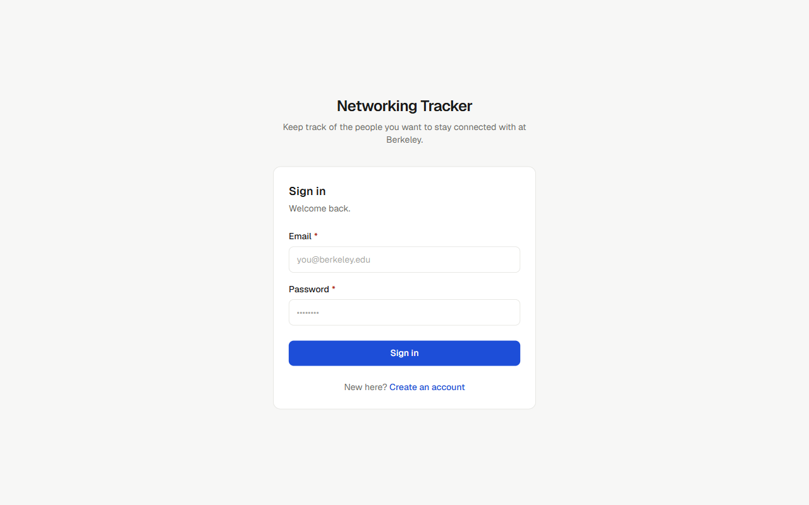
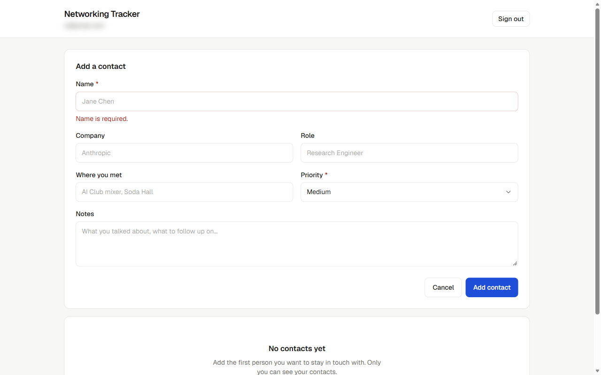
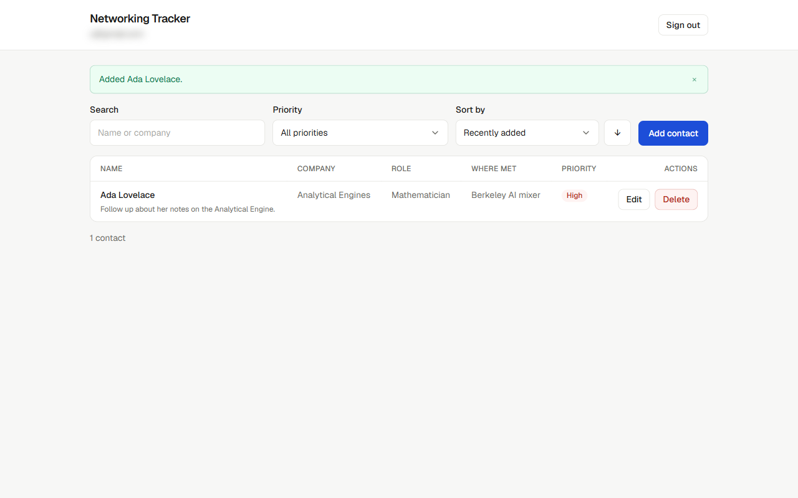
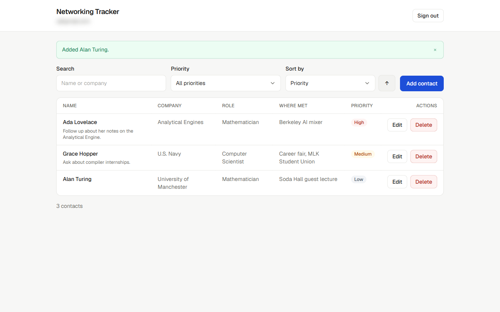
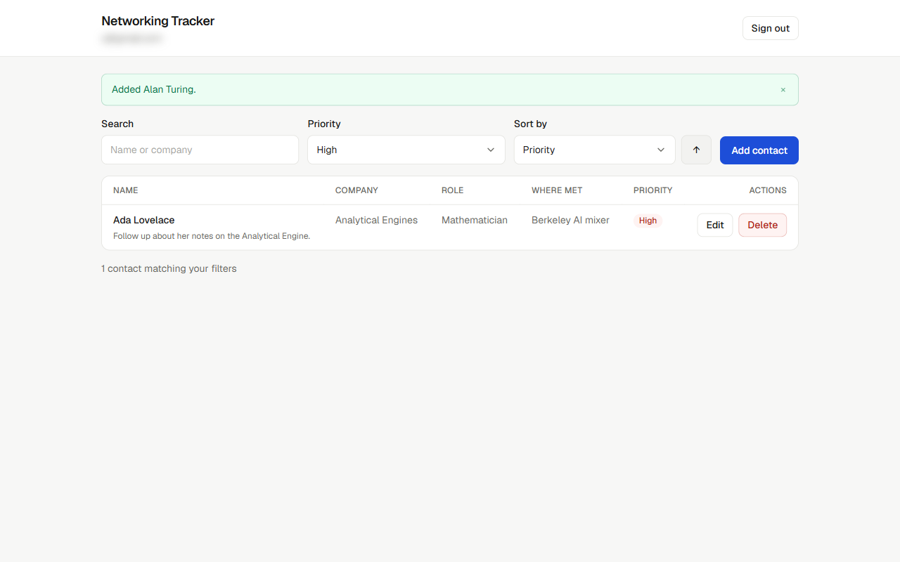
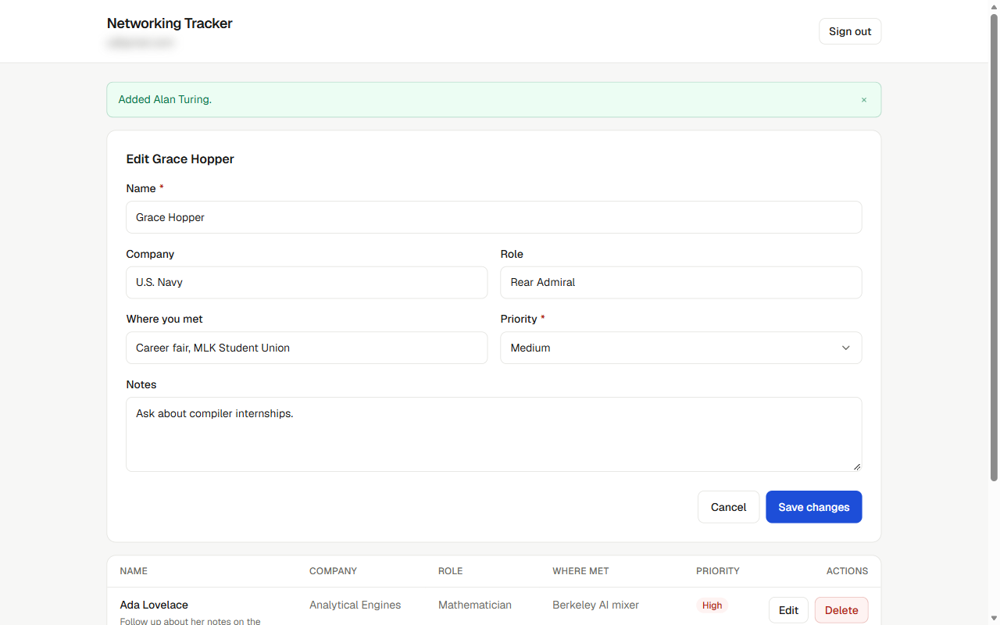
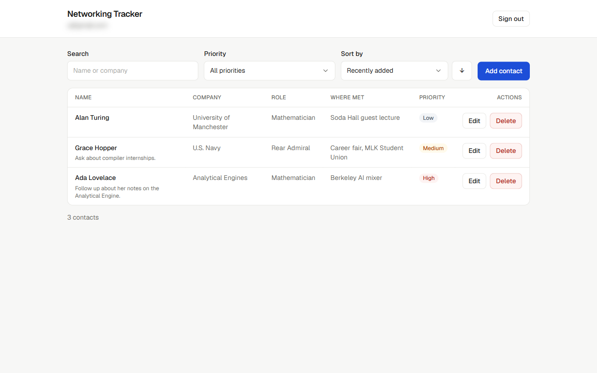
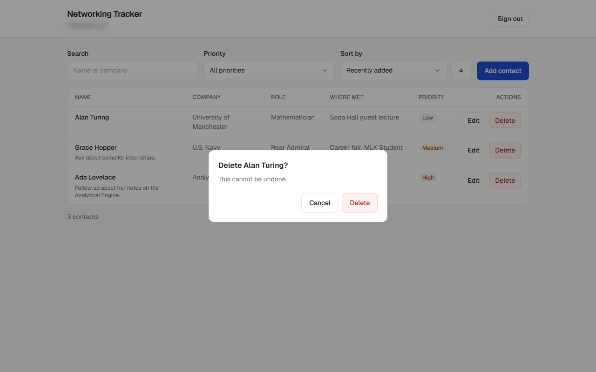
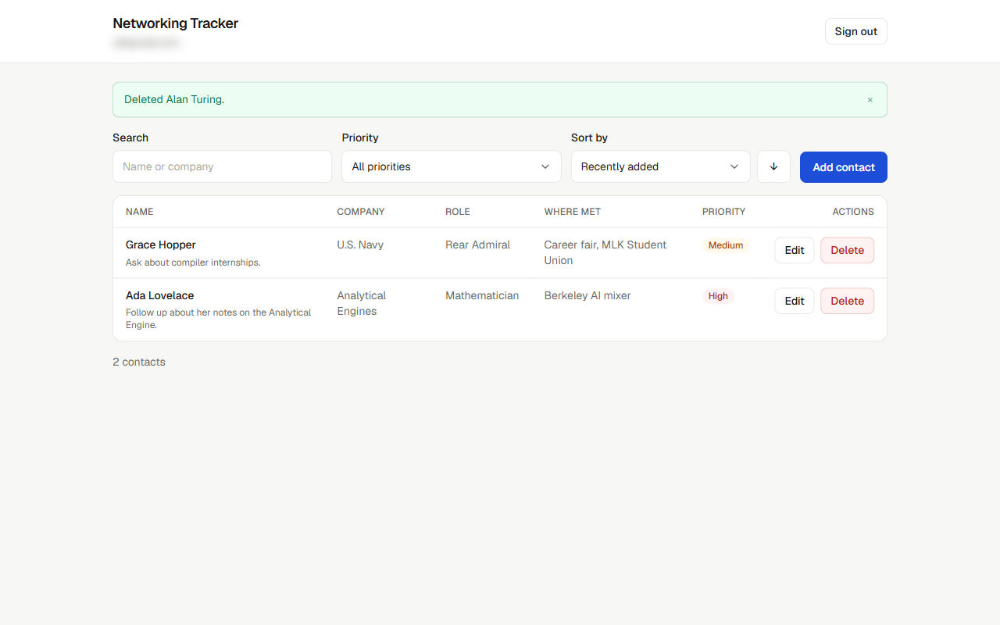
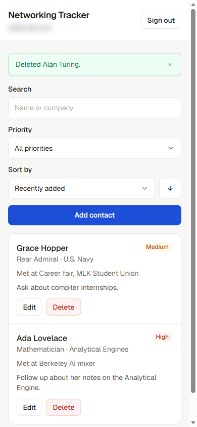

# Networking Tracker

A private networking tracker for the people you want to stay connected with at Berkeley. Sign in, add the people you meet with their company, role, where you met, notes, and a priority, then sort and filter the list as it grows. Every contact belongs to exactly one account, and that ownership is enforced by Postgres Row Level Security rather than by application code — so a signed-in user cannot read or change another user's contacts even if they bypass the UI entirely and call the API directly.

**Live app:** https://networking-tracker-vert.vercel.app

**Repository:** https://github.com/bongo-drums/networking-tracker

---

## Table of contents

- [Features](#features)
- [Screenshots](#screenshots)
- [Technology stack](#technology-stack)
- [Architecture](#architecture)
- [Database schema](#database-schema)
- [Authentication and ownership](#authentication-and-ownership)
- [Local setup](#local-setup)
- [Environment variables](#environment-variables)
- [Testing](#testing)
- [Deployment](#deployment)
- [Security checklist](#security-checklist)
- [Known limitations](#known-limitations)

---

## Features

- **Accounts** — email and password sign up, sign in, and sign out via Neon Managed Better Auth.
- **Private contact list** — each account sees only its own contacts.
- **Full CRUD** — add, view, edit, and delete contacts.
- **Fields** — name, company, role, where you met, notes, and a priority of high, medium, or low.
- **Sort** — by recently added, name, company, or priority, ascending or descending. Priority sorts by actual rank, not alphabetically.
- **Filter** — by priority, plus free-text search across name and company.
- **Validation** — empty names and invalid priorities are rejected with a specific, readable message, in the browser *and* independently in the database.
- **Understandable states** — distinct loading, empty, no-results, success, and error states.
- **Responsive** — a table on desktop, a card list on phones. Works in light and dark mode.

## Screenshots

All of these were taken from the live deployment by [`scripts/capture-screenshots.mjs`](scripts/capture-screenshots.mjs) (`npm run screenshots`), which uses Playwright to drive Microsoft Edge. Signing in was done by hand. The signed-in email address is blurred because these images are in a public repository.

### Sign in and sign out

 

### Invalid input fails safely

If you submit with a blank name, the form rejects it with a clear message and sends no request. The database's CHECK constraint would reject it too.



### Create, sort, and filter



 

### Edit, refresh, and delete

 

The edit is still there after a full browser refresh, because it is stored in Neon Postgres:



 

### Mobile layout



### Two accounts

The two-account privacy check is proven by an automated test rather than a screenshot. It signs in two separate users against the live database. It then confirms that user B cannot read, update, or delete user A's contact, and cannot create a contact owned by user A. All 13 checks pass. See [Integration test — two-user privacy](#integration-test--two-user-privacy) for the full output.

---

## Technology stack

| Layer | Choice | Why |
|---|---|---|
| Framework | Next.js 16 (App Router) + React 19 | One project for UI and hosting, first-class Vercel deployment, and a build that catches type errors before they ship. |
| Language | TypeScript | The contact shape is defined once and checked everywhere, including against the database row type. |
| Styling | Tailwind CSS v4 with a token-based component layer | Design tokens are declared once in `globals.css` and consumed as semantic names (`bg-surface`, `text-muted`). Dark mode is a redefinition of those tokens, not a change to any component. |
| Validation | Zod | One schema describes valid input, and both the form and the tests use it. |
| Database | Neon Postgres | Serverless Postgres with real Row Level Security, which is what makes per-user isolation enforceable in the database. |
| Auth | Neon Managed Better Auth | Issues the JWT that Postgres reads through `auth.user_id()`, so the identity the database trusts is the same one the user signed in with. |
| Data access | Neon Data API (PostgREST) via `@neondatabase/neon-js` | The browser talks to Postgres over HTTP with the user's JWT attached automatically. Every request is subject to RLS. |
| Tests | Vitest | Fast, and shares the project's TypeScript path aliases. |
| Hosting | Vercel | Native Next.js support and per-environment variables. |

---

## Architecture

```
Browser
  │
  ├── React UI  (src/app, src/components)
  │     Presentation only. No SQL, no fetch calls, no auth logic.
  │
  ├── Data access layer  (src/lib/contacts.ts, src/lib/neon.ts)
  │     The only module that talks to the network. Validates every write
  │     through src/lib/validation.ts before sending it, and translates
  │     database errors into readable messages.
  │
  ▼
Neon Auth  ──issues JWT──►  Neon Data API (PostgREST)
                                  │
                                  ▼
                            Neon Postgres
                              • CHECK constraints   ← trusted validation
                              • RLS policies        ← trusted authorization
```

**Frontend and backend are separated** along the line where trust changes.

The frontend is everything in `src/app` and `src/components`. It renders state and collects input. It is fully replaceable — nothing it does is load-bearing for correctness or privacy.

The backend is the Neon Data API plus Postgres itself. This is where validation and authorization actually happen, in `db/schema.sql`. The client-side validation in `src/lib/validation.ts` exists so the user gets an instant, specific error instead of a round trip and a raw constraint violation — but it is a convenience, not the enforcement. Deleting it would degrade the experience and change nothing about what the database accepts.

That distinction is the point of the design. A grader can open the browser console, grab the session token, and POST directly to the Data API with `priority: "urgent"` and someone else's `user_id`. Both attempts fail, because the CHECK constraint and the RLS policy are the things saying no.

### Request flow: adding a contact

1. The user submits the form. `ContactForm` calls `createContact()`.
2. `createContact()` runs the Zod schema. On failure it returns field-keyed messages and stops — no request is made.
3. On success it calls `client.from('contacts').insert(...)`. The Neon client attaches the session JWT.
4. PostgREST receives the request as the `authenticated` role, with the JWT claims loaded into the session.
5. Postgres fills `user_id` from the column's `DEFAULT auth.user_id()`.
6. The `INSERT` policy's `WITH CHECK` verifies `auth.user_id() = user_id`.
7. The CHECK constraints verify the name is non-blank and the priority is one of three values.
8. The row is written and returned. The UI refreshes and shows a success message.

`user_id` is never sent by the client. It is not in the Zod schema, and the database `REVOKE`s insert and update privileges on that column, so a client cannot set it even if it tries.

---

## Database schema

Full definition in [`db/schema.sql`](db/schema.sql).

### `public.contacts`

| Column | Type | Constraints | Notes |
|---|---|---|---|
| `id` | `uuid` | PK, `default gen_random_uuid()` | Server-assigned. |
| `user_id` | `text` | `not null`, `default auth.user_id()` | **The ownership column.** Filled from the caller's JWT. Clients cannot write it. |
| `name` | `text` | `not null`, non-blank, ≤ 120 chars | The only required user-supplied field. |
| `company` | `text` | nullable, ≤ 120 chars | |
| `role` | `text` | nullable, ≤ 120 chars | |
| `where_met` | `text` | nullable, ≤ 200 chars | Where you met this person. |
| `notes` | `text` | nullable, ≤ 2000 chars | |
| `priority` | `text` | `not null`, `default 'medium'`, must be `high`/`medium`/`low` | Enforced by a CHECK constraint. |
| `priority_rank` | `int` | generated, stored | `high`=1, `medium`=2, `low`=3. Exists so "sort by priority" is a real server-side `ORDER BY` — sorting the text would give the meaningless order high, low, medium. |
| `created_at` | `timestamptz` | `not null`, `default now()` | |
| `updated_at` | `timestamptz` | `not null`, `default now()` | Maintained by a trigger, so a client cannot backdate it. |

Indexes on `user_id` and on `(user_id, created_at desc)`, since every query is "my contacts, sorted".

### Constraints that make invalid data impossible

```sql
constraint contacts_name_not_blank check (length(btrim(name)) > 0),
constraint contacts_priority_valid check (priority in ('high', 'medium', 'low')),
```

These are the authoritative validation. The Zod schema mirrors them for the user's benefit.

---

## Authentication and ownership

Neon Managed Better Auth handles sign up, sign in, sessions, and password storage. On sign-in it issues a JWT. The Neon Data API verifies that JWT against the project's JWKS and loads its claims into the Postgres session, which is what makes `auth.user_id()` return the signed-in user's id inside a policy.

### The ownership rule

Every policy says the same thing: **you may touch a row only if its `user_id` equals your own id.**

```sql
alter table public.contacts enable row level security;
alter table public.contacts force  row level security;

create policy contacts_select_own on public.contacts
  for select to authenticated
  using (auth.user_id() = user_id);

create policy contacts_insert_own on public.contacts
  for insert to authenticated
  with check (auth.user_id() = user_id);

create policy contacts_update_own on public.contacts
  for update to authenticated
  using (auth.user_id() = user_id)
  with check (auth.user_id() = user_id);

create policy contacts_delete_own on public.contacts
  for delete to authenticated
  using (auth.user_id() = user_id);
```

Four things worth pointing out:

**`USING` and `WITH CHECK` do different jobs, and `UPDATE` needs both.** `USING` decides which existing rows you are allowed to target. `WITH CHECK` decides what a row is allowed to look like *after* the write. With only `USING`, a user could take a row they legitimately own and rewrite its `user_id` to someone else's — handing the row to another account, or planting a row in someone else's list. `WITH CHECK` is what makes that fail.

**`FORCE` matters.** Without it, the table owner bypasses every policy. With it, there is no role that quietly sees everything.

**Grants and policies are separate gates.** RLS filters rows, but grants decide who may attempt a statement at all. The `anonymous` role has every privilege revoked, so a signed-out request cannot reach the table — it is refused before RLS is consulted. Verified: an unauthenticated `GET /contacts` returns `400 missing authentication credentials: required authorization bearer token in JWT format`.

**Column-level grants are a third layer.** `INSERT` and `UPDATE` privileges are revoked on `id`, `user_id`, `created_at`, and `updated_at`, so a client cannot even name those columns in a write.

### Why the public URLs are safe to expose

`NEXT_PUBLIC_NEON_AUTH_URL` and `NEXT_PUBLIC_NEON_DATA_API_URL` are compiled into the browser bundle. That is by design: they are endpoints, not credentials. Knowing the Data API URL gets an attacker exactly as far as knowing a website's domain — every request still needs a valid JWT, and every row is still filtered by RLS.

The Postgres connection string is a different matter entirely. It grants direct database access and bypasses both PostgREST and RLS, so it is server-only, never prefixed with `NEXT_PUBLIC_`, and never committed. In this project it is used by exactly one thing: `npm run db:migrate`, which runs on a developer's machine.

---

## Local setup

**Requirements:** Node.js 20.9 or newer, and a Neon account.

```bash
git clone <repository-url>
cd networking-tracker
npm install
```

### 1. Create the Neon project

1. In the [Neon Console](https://console.neon.tech), create a project.
2. **Auth** → enable **Managed Better Auth**. Copy the **Auth URL** from the Configuration tab.
3. **Postgres database** → **Data API** → **Enable Data API**, choosing **Managed Better Auth** for JWT authentication. Copy the URL from the API tab.
4. **Dashboard** → **Connect** → copy the connection string.

The Data API is enabled per branch, and is unavailable if IP Allow or Private Networking is on.

### 2. Configure the environment

```bash
cp .env.example .env.local
```

Fill in the three values. `.env.local` is gitignored.

### 3. Create the table and policies

```bash
npm run db:migrate
```

This applies `db/schema.sql` and then reports whether RLS is enabled and how many policies exist, so a successful run is verifiable rather than silent. It is idempotent — safe to re-run after editing the schema.

Neon Auth must be enabled first, because `auth.user_id()` comes from it. If it isn't, the migration says so explicitly.

### 4. Run it

```bash
npm run dev
```

Open http://localhost:3000.

---

## Environment variables

Names only — see [`.env.example`](.env.example). Never commit real values.

| Variable | Exposure | Purpose |
|---|---|---|
| `NEXT_PUBLIC_NEON_AUTH_URL` | Public | Neon Auth endpoint. Used by the browser to sign in and out. |
| `NEXT_PUBLIC_NEON_DATA_API_URL` | Public | Neon Data API endpoint. Used by the browser for all contact CRUD. |
| `DATABASE_URL` | **Server-only** | Postgres connection string. Used only by `npm run db:migrate`. The application never reads it. |
| `NEON_AUTH_BASE_URL` | **Server-only** | Only needed if server-side auth is added. |
| `NEON_AUTH_COOKIE_SECRET` | **Server-only** | Signs the session cookie if server-side auth is added. Generate with `openssl rand -base64 32`. |

---

## Testing

### Unit tests — validation

```bash
npm test
```

21 tests in [`tests/validation.test.ts`](tests/validation.test.ts) covering the rules the database also enforces:

- A valid contact is accepted, and all three priorities are accepted.
- An empty name, a whitespace-only name, a missing name, and a 121-character name are each rejected with a specific message.
- Six invalid priority values (`urgent`, `HIGH`, `Medium`, `""`, `none`, `1`) and a non-string priority are rejected.
- Blank optional fields become `null` rather than empty strings.
- Multiple bad fields are all reported at once, not one at a time.
- A client-supplied `id`, `user_id`, `created_at`, or `updated_at` is stripped from the payload.
- Raw Postgres constraint violations are translated into readable messages.

```
 RUN  v4.1.11

 Test Files  1 passed (1)
      Tests  21 passed (21)
   Duration  1.14s
```

### Integration test — two-user privacy

```bash
npm run test:rls
```

This is the assignment's two-account privacy test, automated. It creates two throwaway accounts through the public Auth API, signs both in, and then, holding no database credentials and no special privileges, checks that:

- User A can create a contact, and the database stamps it with A's `user_id`.
- User B's contact list is empty.
- User B cannot read A's contact even when requesting it by id.
- User B cannot update A's contact.
- User B cannot delete A's contact.
- User B cannot create a contact stamped with A's `user_id`.
- A's contact is unchanged after all of the above.
- An unauthenticated request is refused outright.

At the end it deletes the test contact. The two test accounts stay behind, because Neon Auth doesn't enable the self-service delete-user endpoint by default (the request returns 404). They have throwaway `@example.com` addresses and can be removed from the Neon Console. Passwords are random for each run and are never printed or written to disk.

Output from a real run against the live database (user ids shortened):

```
Preconditions: both users are genuinely authenticated
  PASS  A's token is accepted by the Data API
  PASS  B's token is accepted by the Data API

User A creates a contact
  PASS  A can insert a contact
  PASS  the new row is stamped with A's user_id by the database
  PASS  A can read back their own contact

User B tries to reach User A's contact
  PASS  B's contact list is empty (SELECT policy)
  PASS  B cannot read A's contact even when asking for it by id
  PASS  B cannot update A's contact (UPDATE policy)
  PASS  B cannot delete A's contact (DELETE policy)
  PASS  B cannot create a contact owned by A (INSERT WITH CHECK / column grant)

User A's contact is untouched
  PASS  A's contact still exists
  PASS  A's contact still has its original name

An unauthenticated request is refused
  PASS  a request with no bearer token cannot read contacts

All 13 privacy checks passed.
```

The precondition stage exists because of a lesson learned while writing this test: an earlier version reported that B "could not" update A's contact when in reality B's token was malformed and *every* request was failing. A policy check only means something if the request was accepted and matched zero rows, so each check now requires exactly that, and the test aborts outright if either user cannot authenticate.

---

## Deployment

The app is deployed on Vercel from this repository.

1. **Push to GitHub.** Vercel deploys from the repo, so the repo is the source of truth.
2. **Import the repository in Vercel** (Add New → Project → Import). Vercel auto-detects Next.js; no build settings need changing.
3. **Set the environment variables** in the import screen (or Project → Settings → Environment Variables):
   - `NEXT_PUBLIC_NEON_AUTH_URL`
   - `NEXT_PUBLIC_NEON_DATA_API_URL`

   `DATABASE_URL` is deliberately **not** set on Vercel. The deployed app never touches the Postgres connection string — only the local migration script uses it — so the deployment holds no database credentials at all. `NEXT_PUBLIC_` variables are inlined at build time, so changing them requires a redeploy.
4. **Deploy.**
5. **Add the deployed domain to Neon Auth's trusted origins** (Neon Console → Auth → Configuration). Neon Auth validates the `Origin` header on every auth request and refuses origins it does not trust, so sign-in fails on the production domain until this is done.
6. **Verify in production:** open the live URL in a private window, create two accounts, and confirm each sees only its own contacts. The same check runs automatically via `ORIGIN=https://<your-domain> npm run test:rls`.

Every push to `main` triggers an automatic redeploy.

---

## Security checklist

| Requirement | How it is met |
|---|---|
| `user_id` is `text`, defaults to `auth.user_id()`, cannot be null | `db/schema.sql` |
| RLS enabled on `contacts` | `enable row level security` + `force row level security` |
| Separate select/insert/update/delete policies for authenticated users | Four named policies, all `to authenticated` |
| Every policy restricts to the signed-in user's rows | All four use `auth.user_id() = user_id` |
| Update policies prevent reassigning a row to another user | `WITH CHECK` on the UPDATE policy, plus a trigger that pins `user_id`, plus a column-level `REVOKE UPDATE` |
| Two accounts prove A cannot read or change B's contacts | `npm run test:rls` |
| Public URLs are safe to expose; RLS protects every row | Only endpoints are public; verified that an anonymous request is refused |
| Secrets stay server-only and out of Git | `.gitignore` excludes `.env*` except `.env.example`; `DATABASE_URL` is used only by the migration script |

---

## Known limitations

- **The Neon SDK is a beta.** `@neondatabase/neon-js` is at `0.7.0-beta`. The API is likely to change before 1.0.
- **Sorting and filtering re-query the server.** Fine for a personal contact list; a larger dataset would want pagination, which the app does not implement.
- **No email verification or password reset flow.** Neon Auth supports both; neither is wired up.
- **Search is a substring match** on name and company via `ILIKE`. No fuzzy matching, and no index supporting it — a full-text index would be the fix at scale.
- **Route protection is client-side.** The dashboard renders based on the session hook. This is not a security hole — RLS means an unauthenticated client sees no data regardless — but it does mean a brief loading state instead of a server-side redirect. Adding `src/proxy.ts` with server-side session checks would tighten it.
- **The two-user test leaves its test accounts behind.** It deletes its test contact, but Neon Auth's delete-user endpoint isn't enabled, so each run adds two `rls-test-*@example.com` users. They can be removed from the Neon Console. Enabling user deletion in Neon Auth would let the test clean them up itself.

### What I would do next

1. Move the session check server-side with `src/proxy.ts` so unauthenticated visitors are redirected rather than briefly shown a loading state.
2. Add pagination and a full-text index once a list gets past a few hundred contacts.
3. Add optimistic UI updates so edits feel instant instead of waiting for the refetch.
4. Add a "last contacted" date and a reminder for people you haven't spoken to in a while — the feature that would make this genuinely useful rather than just a list.
